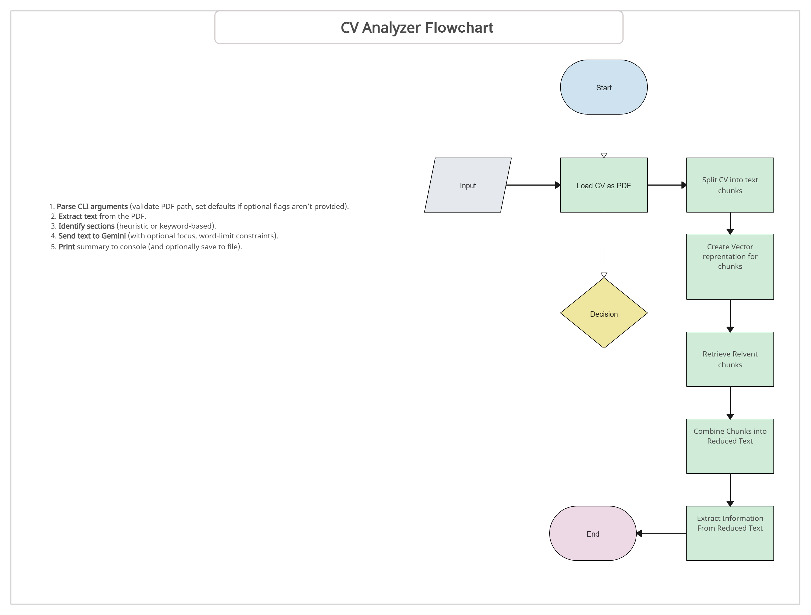

# CV Analyzer  AI Powered CV Summary 

This repository contains a **command-line** Python application that **analyzes a CV in PDF format** and uses the **Gemini LLM** to generate a concise summary. The project is structured around five distinct phases (Requirements Engineering, Architecture, Design, Coding & Testing, and Documentation), each documented according to course guidelines.

---

## Getting started

Welcome to the **CV Analyzer** project! This command-line application processes a PDF CV, 
identifies key sections, and generates a concise summary using the **Gemini** LLM. 
The goal is to make CV screening and review more efficient for both candidates and recruiters.

---


## Table of Contents
1. [Project Overview](#project-overview)  
2. [Installation](#installation)  
3. [Usage](#usage)  
4. [Project Phases](#project-phases)  
   - [Phase 1: Requirements Engineering](#phase-1-requirements-engineering)  
   - [Phase-2: Architecture](#phase-2-architecture)  
   - [Phase 3: Design](#phase-3-design)  
   - [Phase 4: Coding & Testing](#phase-4-coding--testing)  
   - [Phase 5: Documentation](#phase-5-documentation)  

---

## Project Overview

**What it does**:  
1. **Parses a PDF CV** and identifies major sections (Education, Experience, Skills).  
2. **Summarizes** the candidate’s qualifications using **Gemini** (Google Generative AI).  
3. **Outputs** a concise, human-readable summary in the terminal or optionally to a file.

**Why it’s useful**:
- Quickly assess CV highlights (top skills, education, achievements).
- Provides a consistent, short-form summary for recruiters or job applications.

---


## Installation

```
cd existing_repo
git remote add origin https://github.com/1amitos1/cv-analyzer-ai-powered-cv-summary.git
git branch -M main
git push -uf origin main
```


1. **Clone the Repository** :

   ```
   git clone <your-repo-link>.git
   ```

2. **Create & Activate** :

```
conda create --name CV_Analyzer python=3.9
conda activate CV_Analyzer
```

Or:

```
python -m venv venv
source venv/bin/activate  # (macOS/Linux)
venv\Scripts\activate     # (Windows)
```

3. **Install Dependencies:** :

```
pip install -r requirements.txt

```

4. **Set GEMINI_API_KEY (if not using a .env)** :
   
```
export GEMINI_API_KEY="YOUR_REAL_KEY"
# Windows: set GEMINI_API_KEY=YOUR_REAL_KEY

```

## Usage

1. **Basic CLI Command:** :

```
python main.py --pdf /path/to/candidate_cv.pdf --max-words 80

```

- pdf <file>: Path to the PDF CV.

- max-words <int>: (Optional) Limit summary length. Default = 100 words.

- focus <keyword>: (Optional) Emphasize certain topics (e.g., “leadership”).


2. **Sample Example::** :

```
python main.py --pdf sample_cv.pdf --max-words 50 --focus "teamwork"
```

Output:

```
=== AI-Powered CV SUMMARY ===
John Doe has 5 years of experience in software development...

```

3. **Optional::** :

Export summary to `summary.txt` (implemented in `output_manager.py`).


---

## Project Phases

### Phase 1: Requirements Engineering

#### **1.1 Functional Requirements**

| **ID**     | **Requirement**                                                                                                                                    |
|------------|----------------------------------------------------------------------------------------------------------------------------------------------------|
| **FR 1.1** | The system shall accept a PDF file as input via the command-line interface.                                                                        |
| **FR 1.2** | The system shall extract text from the PDF while preserving basic structure (e.g., headings, bulleted lists) as much as possible.                 |
| **FR 2.1** | The system shall analyze the extracted text to identify major CV sections (e.g., Education, Work Experience, Skills, Contact Info).               |
| **FR 2.2** | The system may rely on keyword- or heuristic-based detection (e.g., matching “Education,” “Experience,” etc.) to locate key sections.              |
| **FR 3.1** | The system shall use the Gemini LLM to generate a concise summary of the candidate’s background.                                                   |
| **FR 3.2** | The summary shall emphasize: top skills/areas of expertise, years of experience, highest level of education, and notable achievements.             |
| **FR 4.1** | The system shall print the final summary to the command line.                                                                                      |
| **FR 4.2** | The system may provide an option to export the generated summary to a text file (e.g., summary.txt).                                              |
| **FR 5.1** | The user should be able to specify a maximum word/character count for the summary (e.g., `--max-words 100`).                                       |
| **FR 5.2** | The user may provide a specific focus area (e.g., “leadership,” “technical skills”) to guide the Gemini-based summarization if needed.            |

---

#### **1.2 Non-Functional Requirements**

| **ID**     | **Requirement**                                                                                                                                                                                               |
|------------|---------------------------------------------------------------------------------------------------------------------------------------------------------------------------------------------------------------|
| **NFR 1.1** | **Performance**: The system should handle a typical 2–4 page CV and produce a summary in under 5 seconds on average hardware.                                                                                 |
| **NFR 1.2** | **Performance**: Memory usage should remain within reasonable bounds (no excessive in-memory expansions).                                                                                                     |
| **NFR 2.1** | **Usability**: The command-line interface must be simple to invoke (e.g., `python main.py --pdf candidate_cv.pdf --max-words 100`).                                                                           |
| **NFR 2.2** | **Usability**: Error messages must be clear and informative (e.g., “File not found,” “Unsupported PDF format”).                                                                                               |
| **NFR 3.1** | **Reliability**: The PDF parsing module should handle minor formatting issues or unusual layouts without crashing.                                                                                             |
| **NFR 3.2** | **Reliability**: If the system fails to detect key sections, it should still generate a fallback summary (though it may omit missing sections).                                                               |
| **NFR 4.1** | **Maintainability**: The code shall adhere to PEP 8 (Python style guide).                                                                                                                                     |
| **NFR 4.2** | **Maintainability**: The code should be modular and well-documented, with clear separation of concerns (e.g., PDF parsing, Gemini integration, CLI parsing).                                                  |
| **NFR 5.1** | **Security**: No personal user data (beyond the CV itself) should be stored or transmitted without explicit user consent.                                                                                     |
| **NFR 5.2** | **Security**: If using Gemini’s API, credentials or tokens must be handled securely (e.g., environment variables), not hard-coded in the source.                                                              |

---

#### **1.3 Acceptance Criteria**

| **ID**     | **Criterion**                                                                                                                                                                                                    |
|------------|------------------------------------------------------------------------------------------------------------------------------------------------------------------------------------------------------------------|
| **AC 1.1** | **Accuracy & Completeness**: The summary must mention the candidate’s primary field/role, highest educational attainment (if available), and notable skills. It must avoid unrelated or incorrect details.         |
| **AC 1.2** | **Accuracy & Completeness**: If the candidate has achievements or certifications listed, these should be reflected or referenced in the summary (if space allows).                                                |
| **AC 2.1** | **Readability & Style**: The summary must be written in clear, grammatical English.                                                                                                                               |
| **AC 2.2** | **Readability & Style**: The summary must be limited to the maximum length specified (defaulting to 100 words if no limit is provided).                                                                           |
| **AC 3.1** | **Section Coverage**: If sections like Education, Experience, and Skills are detected, they must be referenced in the generated summary. Missing sections should be skipped gracefully.                            |
| **AC 4.1** | **CLI Functionality**: Running the CLI with correct flags must produce an output summary within 5 seconds for a 2–4 page CV on typical hardware.                                                                  |
| **AC 4.2** | **CLI Functionality**: Invalid inputs (e.g., missing PDF, unreadable file) should produce an informative error message rather than cause a crash.                                                                 |
| **AC 5.1** | **Test Cases**: At least one automated unit test must confirm that the summarizer extracts known sections from a sample CV.                                                                                      |
| **AC 5.2** | **Test Cases**: At least one system-level test must confirm end-to-end functionality (PDF → Gemini Summarization → CLI output).                                                                                 |

---

#### LLM Interactions-Phase 1
**LLM Interactions:** Link to [chats-phase1](/chats/Chat_Phase_1.pdf)

---
---

### Phase 2: Architecture

In this phase, we define how the system is structured and how the user interacts with it. We cover the **command-line interface**, **file system interactions**, **third-party libraries**, and **team responsibilities**. We also include references to the relevant LLM interaction logs.

---

#### 2.1 Command-Line Interface Specification


| **CLI Option**            | **Description**                                                                                            | **Example**                                                 |
|---------------------------|------------------------------------------------------------------------------------------------------------|-------------------------------------------------------------|
| `--pdf <file_path>`       | **Required.** Path to the PDF CV you want to analyze.                                                      | `python main.py --pdf my_resume.pdf`                       |
| `--max-words <integer>`   | **Optional.** Caps the word count of the Gemini-generated summary (default: 100 words).                    | `python main.py --pdf my_resume.pdf --max-words 80`        |
| `--focus <keyword>`       | **Optional.** Guides Gemini to emphasize specific topics (e.g., “leadership,” “technical skills”).          | `python main.py --pdf my_resume.pdf --focus leadership`    |
| `--export <filename>`     | **Optional.** Writes the generated summary to a text file (in addition to printing on the command line).    | `python main.py --pdf my_resume.pdf --export summary.txt`  |


**Flow**:

1. **Parse CLI arguments** (validate PDF path, set defaults if optional flags aren’t provided).
2. **Extract text** from the PDF.
3. **Identify sections** (heuristic or keyword-based).
4. **Send text to Gemini** (with optional focus, word-limit constraints).
5. **Print** summary to console (and optionally save to file).

**Key Points:**

--pdf <file_path> is required; all other options are optional.
--max-words <integer> limits the summary length.
--focus <keyword> instructs the LLM to highlight certain topics in the final summary.
--export <filename> saves the summary to the specified file (e.g., summary.txt), while still displaying it in the console.





---

#### 2.2 File System Interactions

1. **Input**  
   - **PDF File**: Read from user-specified path (`--pdf`).
   - **Credentials**: Load Gemini API key from a **`.env`** file or environment variable to avoid hard-coding sensitive info.
   
2. **Output**  
   - **Terminal Output**: Print the CV summary directly to the command line.
   - **Optional Text File**: If specified in future enhancements, write the summary to something like `summary.txt`.

**Directory Structure (Proposed)**:
CV_Analyzer/ ├── main.py # Entry point for CLI ├── requirements.txt # Dependencies ├── README.md # Documentation ├── .env # Gemini API key (not committed) ├── src/ │ ├── pdf_parser.py # PDF parsing utilities │ ├── summarizer.py # Gemini LLM integration │ └── cli.py # Argument parsing └── chats/ └── phase2_llm_chat.txt # LLM logs for Architecture decisions


#### 2.3 Third-Party Libraries

| **Library**            | **Purpose**                                  | **Notes**                                          |
|------------------------|----------------------------------------------|----------------------------------------------------|
| `PyPDF2` (or similar)  | Extract text from PDFs                      | Allows reading multi-page PDFs, though advanced formatting may require additional solutions. |
| `google-generativeai`  | Interface with Gemini LLM for text generation | Must securely configure API key.                   |
| `python-dotenv`        | Manage environment variables (.env)         | Helps load Gemini credentials at runtime.          |
| `argparse` or `click`  | Parse command-line arguments                | Provides user-friendly CLI.                        |

If additional Python libraries are needed for logging, error handling, or testing (e.g., `pytest`), they should be listed in `requirements.txt`.


---

#### 2.4 Team Member Responsibilities

| **Member**   | **Main Responsibilities**                                      |
|--------------|----------------------------------------------------------------|
| Amit        | *CLI & Arg Parsing, Setting up environment*                    |
| Erez         | *PDF Parsing logic, PDF text extraction*                       |
| Amit        | *Gemini Summarization integration, Prompt engineering*         |
| Erez         | *Testing and QA (unit tests, system-level tests, CI/CD setup)* |


---

#### 2.5 LLM Interactions-Phase 2


For detailed discussions and prompt engineering choices regarding this architecture:

- [Phase 2 LLM Chat Transcript](./chats/Chat_Phase2.pdf)


---

---

### Phase 3: Design

In this phase, we refine our architecture through a **Class-Responsibility-Collaborator (CRC)** outline and simple design diagrams. The goal is to ensure each component is well-defined and easy to maintain before coding.

---

#### 1. High-Level Design Approach

We follow **XP’s principle of simple design**:
- **Keep classes small** and focused on a single responsibility.
- **Minimize dependencies** between classes.
- **Favor clarity** over premature optimization.

---
---

#### 2. CRC Cards

Below is a CRC (Class-Responsibility-Collaborator) description for our key classes. These classes are tentatively located in the `src/` folder (or as makes sense in your project structure).

| **Class**        | **Responsibilities**                                                                                                                                                              | **Collaborators**                                          |
|------------------|----------------------------------------------------------------------------------------------------------------------------------------------------------------------------------|------------------------------------------------------------|
| `CLIHandler`     | - Parse command-line arguments (PDF path, max words, focus)<br>- Validate user input (e.g., check if file exists)<br>- Initiate main application flow                                                                   | - `PDFParser`<br>- `Summarizer`                            |
| `PDFParser`      | - Extract text from the given PDF<br>- Preprocess text (basic cleaning, splitting)                                                                                                                                     | - `CLIHandler`<br>- `Summarizer`                           |
| `Summarizer`     | - Interface with **Gemini** (google-generativeai library)<br>- Construct prompt based on user focus and max-words<br>- Return generated summary text                                                                    | - `CLIHandler`<br>- `PDFParser` (for raw CV text)          |
| `SectionDetector`| - Identify major sections in the raw PDF text (Education, Experience, Skills, etc.)<br>- Provide structured data (e.g., dictionary of section_name → text_content)                                                     | - `PDFParser`<br>- `Summarizer` (can refine prompts or pass structured data) |
| `OutputManager`  | - Print final summary to terminal<br>- (Optional) Write summary to a text file if the user desires                                                                                                                     | - `Summarizer`<br>- `CLIHandler`                           |

---
---

#### 3. Sequence Diagram 

### Sequence Diagram Summary

Below is a concise table capturing each step in the system’s interaction flow:

| **Step / Component**       | **Actions**                                                                                                   |
|----------------------------|----------------------------------------------------------------------------------------------------------------|
| **1. User → CLIHandler**   | Runs `python main.py --pdf resume.pdf --max-words 100`. CLIHandler parses arguments (PDF path, `max_words`, etc.). |
| **2. CLIHandler → PDFParser**  | Calls PDFParser to read and clean the PDF text.                                                             |
| **3. PDFParser → SectionDetector** | Passes raw text to SectionDetector. SectionDetector identifies major sections (Education, Experience, Skills) and returns structured text. |
| **4. CLIHandler → Summarizer**    | Provides structured text (or raw text), `max_words`, and optional focus keyword for summarization.       |
| **5. Summarizer**          | Sends prompt to Gemini LLM API, receives summary text, and returns it to CLIHandler.                          |
| **6. CLIHandler → OutputManager** | Calls OutputManager with the final summary.                                                             |
| **7. OutputManager**       | Prints the summary to the console and optionally writes it to a file (e.g., `summary.txt`).                    |


##### **sequenceDiagram:**

| **Participant** | **Meaning**         | **Responsibilities**                                                                 |
|-----------------|---------------------|---------------------------------------------------------------------------------------|
| **U**           | **User**           | Runs the CLI command with specified arguments (e.g., `--pdf resume.pdf`, `--max-words`). |
| **CLI**         | **CLIHandler**     | Parses command-line arguments, orchestrates the analysis flow.                        |
| **PDF**         | **PDFParser**      | Extracts and cleans text from the PDF document.                                       |
| **SD**          | **SectionDetector** | Identifies major sections (Education, Experience, Skills) within the extracted text.  |
| **SUM**         | **Summarizer**     | Interfaces with the Gemini LLM to generate the concise summary.                       |
| **OM**          | **OutputManager**  | Prints the summary to the console, optionally writes it to a file (e.g., `summary.txt`). |


```

Sequence Diagram (ASCII Representation)

 User                       CLIHandler                 PDFParser                  SectionDetector             Summarizer                OutputManager
  | (1) python main.py        |                           |                           |                           |                            |
  | --pdf resume.pdf          |                           |                           |                           |                            |
  | --max-words 100           |                           |                           |                           |                            |
  |-------------------------->|                           |                           |                           |                            |
  |                           | (2) Parse CLI arguments    |                           |                           |                            |
  |                           |--------------------------->|                           |                           |                            |
  |                           |                           | (3) Read & clean PDF      |                           |                            |
  |                           |                           |-------------------------->|                           |                            |
  |                           |                           |                           | (4) Identify sections     |                            |
  |                           |                           |                           |-------------------------->|                            |
  |                           |                           |                           |                           | (5) Send prompt to Gemini  |
  |                           |                           |                           |                           |--------------------------->|
  |                           |                           |                           |                           | (6) Receive summary text   |
  |                           |                           |                           |                           |<---------------------------|
  |                           | (7) Return summary         |                           |                           |                            |
  |                           |<---------------------------|                           |                           |                            |
  |                           |                           |                           |                           | (8) Summarizer → CLIHandler|
  |                           |                           |                           |                           |--------------------------->|
  |                           |                           |                           |                           | (9) Pass summary to Output |
  |                           |------------------------------------------------------->|                            |
  |                           |                           |                           |                           |                            |
  |                           |                           |                           |                           | (10) Print summary         |
  |                           |                           |                           |                           | (Optional: write to file) |
  |                           |                           |                           |                           |                            |
  |                           |----------------------------> [End of flow]           |                           |                            |
  | (Done)                    |                           |                           |                           |                            |


---
```
---


#### 3.4 LLM Interactions

All design-related conversations with the LLM are recorded in:
- [Phase 3 LLM Chat Transcript](./chats/Chat-Phase_3_Design.pdf)


---
---


### Phase 4: Coding & Testing


#### 4.1 Table of Files:

| **File Name**                                      | **Description**                                                                 |
|----------------------------------------------------|---------------------------------------------------------------------------------|
| [main.py](./src/main.py)                               | Entry point. Parses CLI args and orchestrates the entire CV analysis flow.      |
| [cli_handler.py](./src/cli_handler.py)             | Handles command-line arguments (PDF path, max words, focus) for the analyzer.   |
| [pdf_parser.py](./src/pdf_parser.py)               | Extracts text from PDF files using `PyPDF2`.                                    |
| [section_detector.py](./src/section_detector.py)   | Identifies major sections (Education, Experience, etc.) in the CV text.         |
| [summarizer.py](./src/summarizer.py)               | Interfaces with **Gemini** (Google Generative AI) for the AI-powered summary.   |
| [output_manager.py](./src/output_manager.py)       | Prints the summary to console or writes it to a text file.                      |
| [test_unit_summarizer.py](./tests/test_unit_summarizer.py) | Multiple test cases for Summarizer logic.                                    |
| [test_system_flow.py](./tests/test_system_flow.py) | End-to-end test verifying CLI → Summarizer → Output.      


#### 4.2 System Test: 
[Phase 2 LLM Chat Transcript](./chats/Chat_Phase_4_testing.pdf)

[test_unit_summarizer.py](./tests/test_unit_summarizer.py)

[test_system_flow.py](./tests/test_system_flow.py)

##### Output:
```
(cv_analyzer) python -m unittest discover -s tests

.
----------------------------------------------------------------------
Ran 1 test in 1.646s

OK
(cv_analyzer)  python -m unittest discover -s tests

.
----------------------------------------------------------------------
Ran 1 test in 1.558s

OK
(cv_analyzer)  python -m unittest discover -s tests -v

test_full_flow (test_system_flow.TestSystemFlow.test_full_flow) ... ok

----------------------------------------------------------------------
Ran 1 test in 1.514s

OK
```
---

